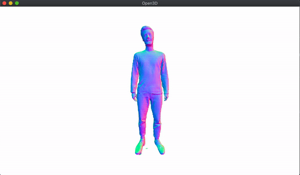

# Mesh Sequence Player
A simple mesh sequence player based on [open3d](https://github.com/intel-isl/Open3D). It just loads all the mesh files and plays them back. The tool is intended for preview and visualisation purposes only.



### Installation
To install the necessary packages, use the requirements file:

```
pip install -r requirements.txt
```

### Usage
To display a sequence of mesh files just run the following command:

```
python mesh-sequence-player.py mesh-folder --format *.obj
```

#### Help

```
usage: mesh-sequence-player.py [-h] [--format FORMAT] [--fps FPS] [--no-loop]
                               input

Play mesh sequences directly in python.

positional arguments:
  input            Path to the mesh files (directory).

optional arguments:
  -h, --help       show this help message and exit
  --format FORMAT  File format (Default *.obj).
  --fps FPS        Framerate for playback.
  --no-loop        Do not loop the sequence.
```

### About
MIT License - Copyright (c) 2021 Florian Bruggisser
