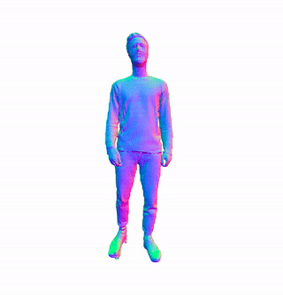

# Mesh Sequence Player
A simple mesh sequence player based on [open3d](https://github.com/intel-isl/Open3D).



It just loads all the mesh files and plays them back. The tool is intended for preview and visualisation purposes only. The software uses multi-processing to load meshes as fast as possible.

### Installation
To install the necessary packages, use the requirements file:

```
pip install git+https://github.com/cansik/mesh-sequence-player.git@1.7.0
```

### Usage
To display a sequence of mesh files just run the following command:

```
mesh-sequence-player folder_to_meshes
```

#### Rendering
It is also possible to render the individual frames into a mp4 file. Currently only one mesh view will be rendered. If an `output` path is provided, the `no-loop` option is automatically set to `True` and rendering will run with `1000.0 FPS` to render as fast as possible.

```
mesh-sequence-player folder_to_meshes --output render.mp4
```

#### Lazy Loading
To create renderings of very large sequences it is possible to use the `--lazy` parameter to load the geometries every frame instead of all at once. This is only recommended for rendering and not realtime playback.

#### Help
Here is the full help file.

```
usage: mesh-sequence-player [-h] [--format FORMAT] [--fps FPS] [--no-loop]
                            [--size width height] [--background r g b]
                            [--hidden] [--rotate ROTATE] [--output OUTPUT]
                            [--load-safe] [--lazy] [-p] [--debug]
                            input

Play mesh sequences directly in python.

positional arguments:
  input                Path to the mesh files (directory).

optional arguments:
  -h, --help           show this help message and exit
  --format FORMAT      File format (default *.obj).
  --fps FPS            Framerate for playback.
  --no-loop            Do not loop the sequence.
  --size width height  Size of the window.
  --background r g b   Background color (0-255).
  --hidden             Hide preview window.
  --rotate ROTATE      Horizontal axis rotation.
  --output OUTPUT      Output path to mp4 file. Sets no-loop to True.
  --load-safe          Load meshes the safe way and with texture (but slower).
  --lazy               Load meshes one at a time (render large sequences).
  -p, --pointcloud     Load pointclouds (*.ply) instead of meshes.
  --debug              Show debug information.
```

### About
MIT License - Copyright (c) 2021 Florian Bruggisser
